# Embedded Pebble emulator

The **embedded emulator** runs Pebble QEMU on the IDE host and exposes it to the browser for display, install, and simulator controls. It is distinct from the **WASM emulator** (`/wasm-emulator`), which runs firmware in the browser without QEMU.

Use this document when operating the emulator from the UI, calling HTTP APIs, writing automation, or debugging display/handshake issues.

## Architecture

```mermaid
flowchart LR
  subgraph browser [Browser]
    UI[EmbeddedEmulatorHost]
    noVNC[noVNC RFB client]
    PhoneWS[Phone WebSocket]
    Phoenix[Phoenix /socket]
  end

  subgraph ide [IDE host]
    API[EmulatorController HTTP]
    VncCh[EmulatorVncChannel]
    VncProxy[EmulatorProxySocket]
  end

  subgraph session [Emulator.Session facade]
    QEMU[QEMU Pebble]
    Router[Pebble protocol router]
    Pypkjs[pypkjs phone bridge]
  end

  subgraph session_modules [Session.* helpers]
    SessionQemu[Session.Qemu]
    SessionHost[Session.ProcessHost]
    SessionVnc[Session.Vnc]
    SessionPypkjs[Session.Pypkjs]
    SessionRuntime[Session.RuntimeSetup]
    SessionInstall[Session.Install]
    SessionInfo[Session.Info]
    SessionHealth[Session.Health]
    SessionControl[Session.Control]
    SessionVncH[Session.VncHandlers]
    SessionStartup[Session.Startup]
    SessionInstallCalls[Session.InstallCalls]
    SessionLifecycle[Session.Lifecycle]
  end

  session --> session_modules

  UI --> API
  UI --> Phoenix
  Phoenix --> VncCh
  VncCh -->|TCP VNC| QEMU
  UI --> noVNC
  noVNC -->|frame events b64| VncCh
  UI --> PhoneWS
  PhoneWS --> VncProxy
  VncProxy --> Pypkjs
  API --> session
  UI -->|control JSON| API
  API --> Router
  Router --> QEMU
```



| Component | Role |
|-----------|------|
| `Ide.Emulator.Session` | GenServer facade per session: orchestrates QEMU, VNC, phone bridge, install |
| `Ide.Emulator.Session.Qemu` | QEMU argv, flash images, boot markers, machine args |
| `Ide.Emulator.Session.ProcessHost` | Daemon spawn, port allocation, boot/TCP waits |
| `Ide.Emulator.Session.Vnc` | VNC TCP readiness and RFB banner capture |
| `Ide.Emulator.Session.Pypkjs` | pypkjs argv and process start |
| `Ide.Emulator.Session.RuntimeSetup` | `runtime_status/1`, dependency install, init validation |
| `Ide.Emulator.Session.Install` | PBW install orchestration and QEMU reset retries |
| `Ide.Emulator.Session.Info` | `session_info` map for HTTP/API (`public_info`, readiness flags) |
| `Ide.Emulator.Session.Health` | Ping/health checks, child `EXIT` handling |
| `Ide.Emulator.Session.Control` | QEMU control packets and simulator settings batch apply |
| `Ide.Emulator.Session.VncHandlers` | GenServer VNC TCP claim/return/discard and buffer relay |
| `Ide.Emulator.Session.Startup` | Initial state, QEMU/router/pypkjs boot, install reset |
| `Ide.Emulator.Session.InstallCalls` | GenServer install/prepare/reset `handle_call` replies |
| `Ide.Emulator.Session.Lifecycle` | Session ids, idle timeout, ping timestamps |
| `Ide.Emulator.PBWInstaller.Putbytes` | PutBytes chunking and ack handling |
| `Ide.Emulator.PBWInstaller.BlobDb` | BlobDB insert/delete before AppFetch |
| `Ide.Emulator.PBWInstaller.AppFetch` | AppFetch handshake and UUID verification |
| `Ide.Emulator.PBWInstaller.Parts` | PutBytes init/put/commit/install per PBW part |
| `Ide.Emulator.PBWInstaller.PostInstall` | Post-install probe, frame observation, payload enrichment |
| `Ide.Emulator.Screenshot` | Firmware screenshot with VNC fallback (`Ide.Emulator.screenshot/2` delegates here) |
| `Ide.Emulator.FirmwareScreenshot` | Endpoint 8000 framebuffer capture |
| `Ide.Emulator.VncScreenshot` | RFB framebuffer read (fallback path) |
| `IdeWeb.EmulatorController` | Launch, ping, install, control, kill; serves PBW artifact |
| `IdeWeb.EmulatorVncChannel` | Relays RFB bytes between browser and QEMU over Phoenix channel `emulator_vnc:<session_id>` |
| `IdeWeb.EmulatorVncChannel.State` | Typed channel assigns (`session_id`, `session_pid`, `tcp`) |
| `IdeWeb.EmulatorProxySocket` | Raw WebSocket proxy to local TCP (used for `/ws/phone` and legacy `/ws/vnc`) |
| `embedded_emulator.ts` | Thin browser orchestrator (toolbar, state, feedback) |
| `emulator_http.ts` | Shared `postJSON`, CSRF, WebSocket URL helpers |
| `emulator_session_client.ts` | Launch, stop, ping, install HTTP session API |
| `emulator_vnc.ts` | Phoenix VNC channel + noVNC display |
| `emulator_simulator_delivery.ts` | Simulator settings → QEMU batch API, phone bridge, weather |
| `qemu_control.ts` | QEMU protocol encoders (shared with WASM emulator) |
| `install_prep.ex` | Install pacing, reuse settle, reset-needed checks |

`IdeWeb.EmulatorProxyClient` uses `WebSockex.start_link/3` (no custom options); the browser phone bridge opens via `EmulatorProxySocket` or the channel path above.

### Browser modules (`ide/assets/js/`)

IDE frontend sources are **TypeScript** (esbuild bundles to `priv/static/assets/*.js`). Shared API types live in [`ide/assets/js/types/emulator.ts`](../assets/js/types/emulator.ts) (`EmulatorSessionInfo`, launch/ping payloads).

| File | Role |
|------|------|
| `app.ts` | LiveView `Hooks`, Firebase auth, entry bundle |
| `user_socket.ts` | Shared Phoenix `/socket` for VNC + LSP |
| `editor/codemirror_editor_host.ts` | CodeMirror 6 + LSP editor host |
| `emulator/embedded_emulator.ts` | `EmbeddedEmulatorHost`: toolbar, lifecycle, event log, display/phone orchestration |
| `emulator/emulator_session_client.ts` | Launch, ping, kill, native install HTTP |
| `emulator/emulator_vnc.ts` | Phoenix `emulator_vnc:*` channel + noVNC |
| `emulator/emulator_simulator_delivery.ts` | Simulator settings, weather, phone-bridge install |
| `emulator/emulator_http.ts` | `postJSON`, CSRF, WebSocket URL helpers |
| `emulator/qemu_control.ts` | QEMU packet encoders (shared with WASM emulator) |
| `emulator/wasm_emulator.ts` | WASM emulator LiveView host |

**Frontend checks** (from repo root):

```bash
cd ide/assets && npm ci && npm run typecheck
cd ide && mix assets.build
```

Docker production builds run `npm run typecheck` before `mix assets.deploy`.

### Elixir types (server)

| Module | Role |
|--------|------|
| `Ide.WatchModels` / `Ide.WatchModels.Profile` | Canonical watch catalog (`profile_for/1`, `profile_screen/1`); string-key maps at runtime |
| `Ide.Emulator.Types` | Session API contracts: `session_state`, `qemu_args_state`, `launch_opts`, `session_info`, `runtime_status`, `simulator_settings`, `install_context`, `qemu_features`, `putbytes_phase_meta`, `screenshot_capture_opts`, errors |
| `Ide.Emulator.Session.Config` | Shared `Application.get_env(:ide, Session, …)` for Session, InstallPrep, StartupCheck |
| `Ide.Emulator.QemuControl` | QEMU `command/0` and `external_cli_command/0` encoders |
| `Ide.Debugger.Types.SimulatorSettings` | Normalized simulator settings (shared with debugger; used by `apply_simulator_settings`) |

## Prerequisites

On the machine running the IDE:

1. **Pebble SDK / QEMU** — same dependencies as the IDE emulator health check (Settings → emulator setup, or server logs at boot via `Ide.Emulator.StartupCheck`).
2. **Environment** (see `config/config.exs`, `Ide.Emulator.Session`):
   - `ELM_PEBBLE_EMBEDDED_EMULATOR` — default `true`; set `false` to disable backend QEMU.
   - `ELM_PEBBLE_QEMU_BIN`, `ELM_PEBBLE_QEMU_IMAGE_ROOT`, `ELM_PEBBLE_PYPKJS_BIN` — optional overrides.
3. **Auth** — embedded APIs require a logged-in IDE user (session cookie). POST requests need the CSRF meta tag (`x-csrf-token`).

Run the IDE:

```bash
cd ide
mix setup
mix phx.server
```

Open a project emulator page: `http://localhost:4000/projects/<slug>/emulator`.

After frontend changes: `npm run typecheck --prefix assets` (optional but enforced in Docker), `mix assets.build`, and hard-refresh the page. The event log includes a **UI build** string (e.g. `v23-typescript`) to confirm the loaded client bundle.

## Browser workflow

1. **Launch** — builds/uses a PBW for the project and platform, starts `Emulator.Session`, waits until `display_ready` (QEMU up + VNC banner captured).
2. **Display** — connects noVNC through Phoenix channel `emulator_vnc:<id>` (production path). Raw `/api/emulator/:id/ws/vnc` is for tools, tests, and local proxy only — do not point the embedded browser host at it without re-validation (see **VNC policy** below).
3. **Install** — pushes the PBW to the running watch via native installer (`POST .../install`) or phone-bridge fallback when pypkjs is available.
4. **Controls** — buttons and simulator sliders send QEMU control packets via `POST .../control`.
5. **Phone bridge** — optional WebSocket to `/api/emulator/:id/ws/phone` for AppLog, storage debug, companion-style messages.
6. **Stop** — `POST .../kill` or leaving the page; sessions also idle-timeout (default 5 minutes).

The in-page **event log** and **Copy feedback report** capture session state, VNC diagnostics, and timestamps for bug reports.

## Session lifecycle

### 1. Launch

**HTTP:** `POST /api/emulator/launch`

```json
{
  "slug": "digital",
  "platform": "diorite"
}
```

**Response** (public session map, abbreviated):

| Field | Meaning |
|-------|---------|
| `id` | Session id (use in all subsequent URLs) |
| `platform` | Watch model id (`diorite`, `basalt`, …) |
| `screen` | `{width, height}` from watch profile |
| `artifact_path` | `GET` PBW built for this session |
| `install_path`, `ping_path`, `kill_path` | POST endpoints |
| `vnc_path` | Legacy raw VNC WebSocket path (see Display) |
| `phone_path` | Phone-bridge WebSocket path |
| `controls` | Supported control names |
| `display_ready` | `true` when VNC is accepting connections |
| `phone_bridge_ready` | `true` when pypkjs phone port is up |
| `backend_enabled` | `false` if embedded emulator disabled in config |

**Elixir:**

```elixir
{:ok, info} =
  Ide.Emulator.launch(
    project_slug: "users/1/digital",
    platform: "diorite",
    artifact_path: "/path/to/app.pbw",  # optional; launch usually sets this
    has_phone_companion: false,
    has_companion_preferences: false
  )
```

Launch acquires a slot (`Ide.Emulator.SlotLimiter`, default max 8 concurrent sessions).

### 2. Keep-alive / status

**HTTP:** `POST /api/emulator/:id/ping`

Returns the same public map as launch, plus `alive: true`, refreshed `display_ready`, `installing`, etc. The browser pings after display connect.

### 3. Display (VNC / noVNC)

Current client path (v21+):

1. Open shared Phoenix socket: `GET /socket` (WebSocket or long-poll fallback).
2. Join channel topic: `emulator_vnc:<session_id>`.
3. Join reply includes `initial`: base64-encoded RFB data (server banner, typically 12 bytes `RFB 003.008\n`).
4. Client holds `initial` until noVNC attaches, then feeds it into the receive queue and starts the handshake.
5. noVNC sends client frames with channel event `frame` and payload `{b64: "<base64>"}`.
6. Server relays to QEMU; server pushes `{b64: "..."}` `frame` events for outbound bytes.

**Legacy / alternate:** `GET /api/emulator/:id/ws/vnc` upgrades to `EmulatorProxySocket` → QEMU VNC TCP. This still works for host-local tools and tests; the browser uses the channel path because raw `/ws/vnc` upgrades were unreliable in some environments.

**Readiness:** wait for `display_ready: true` on ping/launch before expecting a picture.

### 4. Install PBW

**HTTP:** `POST /api/emulator/:id/install`

Installs the session’s `artifact_path` PBW through the Pebble protocol router into QEMU (same path as the IDE “Install” button). Response:

```json
{ "status": "ok", "result": { ... } }
```

The browser may fall back to **phone-bridge install** if the native install path fails and `phone_path` is connected.

**Artifact:** `GET /api/emulator/:id/artifact` — raw PBW bytes.

### 5. QEMU controls

**HTTP:** `POST /api/emulator/:id/control`

```json
{
  "protocol": 8,
  "payload": [0, 4]
}
```

`protocol` is `0..255`. `payload` is a JSON array of byte values `0..255`; the server validates via `Ide.Emulator.QemuControl` and forwards through `Ide.Emulator.PebbleProtocol.Router`.

**Canonical mapping** (shared by `assets/js/emulator/qemu_control.js` and `lib/ide/emulator/qemu_control.ex`):

| UI / API name | `protocol` | `payload` (typical) |
|---------------|------------|---------------------|
| Buttons (bitmask) | `8` | `[buttonState]` — bits: back=1, up=2, select=4, down=8 |
| Tap | `2` | `[0, 1]` press, `[0, 0]` release |
| Battery | `5` | `[percent, charging_flag]` |
| Bluetooth | `3` | `[connected]` — `0` or `1` |
| 24h time format | `9` | `[enabled]` — `0` or `1` |
| Timeline peek | `10` | `[enabled]` — `0` or `1` |
| Accelerometer | `11` | 6 bytes: int16 x, y, z big-endian |
| Compass | `12` | 3 bytes: heading high/low, valid flag |

**Simulator settings → QEMU:** changing the emulator page “Simulator settings” form pushes `simulator_settings_applied` to the browser, which calls `applySimulatorSettingsToQemu/2`. Settings are re-applied automatically after **Launch** and when resuming a persisted session (so defaults reach QEMU even if the form was loaded before QEMU started).

**Simulated date/time** (`use_simulated_time`, `simulated_date`, `simulated_time`) is **debugger-only** on the emulator settings form (hidden in `:emulator` mode). It affects Elm debugger stepping via `Ide.Debugger.DeviceData`, not embedded QEMU watch-face time. There is no QEMU control protocol for set-time in embedded sessions; external SDK emulators receive `emu-set-time` via `QemuControl.external_cli_commands/1`.

**Batch apply:** `POST /api/emulator/:id/simulator-settings` with `{"settings": {...}}` applies all mapped QEMU controls in one request (`Ide.Emulator.apply_simulator_settings/2`). The browser delivery module uses this after launch/resume, with per-control `/control` fallback.

**External SDK emulator:** battery, Bluetooth, time format, timeline peek, compass, and simulated time (when enabled) map to `pebble emu-*` via `QemuControl.external_cli_commands/1`.

### Simulator delivery matrix

| Setting | Embedded QEMU | Phone bridge | Debugger runtime | External `pebble emu-*` |
|---------|---------------|--------------|------------------|-------------------------|
| Battery / charging | protocol 5 | settings JSON | DeviceData | `emu-battery` |
| Bluetooth | protocol 3 | settings JSON | DeviceData | `emu-bt-connection` |
| 24h format | protocol 9 | — | — | `emu-time-format` |
| Timeline peek | protocol 10 | — | — | `emu-set-timeline-quick-view` |
| Compass | protocol 12 | — | — | `emu-compass` |
| Simulated date/time | — | — | DeviceData | `emu-set-time` (when enabled) |
| Weather / companion | — | inject + JSON | subscriptions | — |

**Elixir:**

```elixir
:ok = Ide.Emulator.control(session_id, 8, <<0>>)  # release all buttons

commands = Ide.Emulator.QemuControl.commands_from_simulator_settings(settings)
```

### 6. Phone bridge WebSocket

**URL:** `ws://<host>/api/emulator/:id/ws/phone` (or `wss://`)

Requires auth cookies like other emulator routes. Used for:

- Pebble protocol frames (`0x01` + endpoint + payload) — AppLog, PutBytes, etc.
- JSON simulator settings (`0x0e` prefix)
- PBW install handoff to companion cache (`0x04` messages) when JS companion is in use

**Host-local test** (no browser):

```bash
cd ide
mix run scripts/test_emulator_phone_ws.exs
```

**Direct TCP** (from the same machine as the IDE):

```elixir
{:ok, pid} = Ide.Emulator.lookup(session_id)
port = Ide.Emulator.Session.local_port(pid, :phone)  # or :vnc
```

### 7. Kill session

**HTTP:** `POST /api/emulator/:id/kill`

Stops the session GenServer, releases the slot, and tears down QEMU/pypkjs.

**Elixir:** `Ide.Emulator.kill(session_id)`

## HTTP API summary

All routes under `/api` require authentication unless noted.

| Method | Path | Purpose |
|--------|------|---------|
| `POST` | `/api/emulator/launch` | Start session (`slug`, `platform`) |
| `POST` | `/api/emulator/:id/ping` | Session status + `alive` |
| `POST` | `/api/emulator/:id/install` | Install PBW into QEMU |
| `POST` | `/api/emulator/:id/control` | QEMU control packet |
| `POST` | `/api/emulator/:id/simulator-settings` | Batch apply normalized simulator settings to QEMU |
| `POST` | `/api/emulator/:id/kill` | End session |
| `GET` | `/api/emulator/:id/artifact` | Download session PBW |
| `GET` | `/api/emulator/:id/ws/vnc` | Raw VNC WebSocket (proxy) |
| `GET` | `/api/emulator/:id/ws/phone` | Phone bridge WebSocket |
| `GET` | `/api/emulator/config-return` | Companion config popup return HTML |

Phoenix channel (browser):

| Topic | Events | Purpose |
|-------|--------|---------|
| `emulator_vnc:<session_id>` | join → `initial` (base64) | RFB banner |
| | `frame` / `{b64}` in & out | Full VNC byte stream |

Shared socket: `/socket` with CSRF param `_csrf_token` on connect (see `user_socket.js`).

### MCP (IDE agent tools, `:build` capability)

These call the same `Ide.Emulator.Workflow` / `Ide.Emulator` stack as the HTTP routes above (not the external `pebble install --emulator` CLI path):

| Tool | Purpose |
|------|---------|
| `emulator_launch` | Package + start embedded session; optional `wait_display_ready` |
| `emulator_install` | Install session PBW (`session_id` from launch) |
| `emulator_ping` | Session status |
| `emulator_kill` | Stop session |
| `emulator_run` | Launch → wait display → install → optional `logs_snapshot_seconds` → optional `kill_after` |
| `emulator_logs` | Capture QEMU console + protocol AppLog/system lines from a running session |

Typical agent workflow: `emulator_run` with `slug`, `platform` (e.g. `basalt`), and optional `open_from_launcher: true` for games. Log capture defaults to 20s on `emulator_run` (embedded console/protocol, not `pebble logs --emulator`). For manual steps, `emulator_launch` then `emulator_install` with the returned `session.id`.

## Programmatic examples

### curl (from a logged-in browser session)

Export cookies and CSRF from DevTools, then:

```bash
CSRF=...  # from meta[name=csrf-token]
COOKIE=...  # session cookie

curl -s -X POST http://localhost:4000/api/emulator/launch \
  -H "content-type: application/json" \
  -H "x-csrf-token: $CSRF" \
  -b "$COOKIE" \
  -d '{"slug":"digital","platform":"diorite"}' | jq .
```

### IEx (on IDE node)

```elixir
# Check dependencies
Ide.Emulator.runtime_status("diorite")

# Full session in test/dev with processes
Application.put_env(:ide, Ide.Emulator.Session, start_processes: true)

{:ok, info} =
  Ide.Emulator.launch(
    project_slug: "manual-test",
    platform: "diorite",
    artifact_path: nil,
    has_phone_companion: false,
    has_companion_preferences: false
  )

:ok = Ide.Emulator.control(info.id, 8, <<0>>)
{:ok, _} = Ide.Emulator.install(info.id)
Ide.Emulator.kill(info.id)
```

Integration tests use `Ide.TestSupport.EmulatorSessionEnv.run_live/1` and `EmulatorLaunch.launch/1` (see `test/ide_web/emulator_vnc_channel_handshake_test.exs`).

## Configuration and limits

| Setting | Location | Default |
|---------|----------|---------|
| Embedded emulator on/off | `ELM_PEBBLE_EMBEDDED_EMULATOR` | enabled |
| Idle timeout | `Ide.Emulator.Session` `:idle_timeout_ms` | 5 min |
| Max concurrent sessions | `Ide.Emulator.SlotLimiter` `:max_slots` | 8 |
| QEMU images | `ELM_PEBBLE_QEMU_IMAGE_ROOT` | `~/.pebble-sdk/.../pebble` |

Tests often set `start_processes: false` on `Ide.Emulator.Session` to avoid spawning QEMU during `mix test`.

## Troubleshooting

| Symptom | What to check |
|---------|----------------|
| Launch 422 / unavailable | `Ide.Emulator.runtime_status/1` missing components; Settings emulator check |
| Display timeout, 12 bytes only | Event log: join `initial`, “pushing N bytes”, `framesReceived` on feedback report; UI build string; server restarted after channel changes |
| `display_ready: false` | QEMU still booting; VNC banner not captured — wait and ping again |
| Install fails | `POST /install` error body; console logs in session; try phone bridge if companion app |
| Install OK but app list / launcher only | Install already sent `AppRunStateStart` once (AppFetch + PutBytes). Do **not** send a second start right after install. If you tapped Select and see `AppRunState stop` then `App fault! PC: 0 LR: 0`, the app crashed in init/first draw (toolchain), not a missing launch packet. |
| Verify display with a trivial watchface | Create a project from template **Watchface: Smoke screen (checkerboard, emulator debug)** (`watchface-smoke-screen`). After install you should see four equal black/white quadrants in VNC; if not, the problem is install/launch, not watchface logic. |
| Watchface shows launcher or blank white face | Rebuild/install after toolchain updates. Watchfaces must compile with `ELMC_WATCHFACE_MODE` (from `package.json` `"watchface": true` and/or IDE `target_type: watchface`). In AppLog look for `elmc init rc=0 launch_reason=… mode=1` (`mode=1` = watchface). `mode=0` means the PBW was built as an app. |
| Install OK, logs show `AppRunState start`, VNC stays black | Often a stale noVNC buffer (app drew, client did not refresh). Hard-refresh the page or reinstall; recent builds request a full framebuffer update after install/app start. Checkerboard smoke on B&W VNC looks like black + light gray in canvas samples, not four colors. |
| Flood of `Data logging` lines after install | Emulator storage logging (optional `ELMC_AGENT_PROBES` when enabled). Not necessarily a crash; check AppLog for `App fault!` or `elmc init rc=`. |
| Install progress stuck ~5% on watch | Early PutBytes/binary phase — Bluetooth may not be ready yet; wait a few seconds after launch (emery/flint) then install, or stop and relaunch; check server logs for `putbytes_failed` / timeout |
| Launch takes many seconds | Normal while QEMU boots to “Ready for communication” and VNC comes up (typically under ~10s); a duplicate console wait was removed in recent builds |
| Phone bridge not ready | `phone_bridge_ready: false` — pypkjs missing or not started; non-fatal for display-only apps |
| Stale session after refresh | Browser re-pings `ping_path`; may call `kill` and launch again |

**Feedback report** (in emulator UI): includes UI build, session ping JSON, `simulatorSettingsSource`, `simulatorSettingsAppliedAt`, `lastQemuSettingsApply`, VNC byte/frame counts, and ordered event log — paste when filing bugs.

## VNC policy

- **Browser (embedded emulator):** Phoenix channel `emulator_vnc:<session_id>` only (`EmulatorVncChannel` + `emulator_vnc.js`).
- **`GET /api/emulator/:id/ws/vnc`:** raw TCP↔WebSocket proxy for automation, `emulator_vnc_http_ws_test.exs`, and local tools — not the production browser path.
- Re-enabling direct browser VNC requires re-validating auth, buffering, and RFB handshake behavior end-to-end.

## Related code

| Path | Description |
|------|-------------|
| `assets/js/emulator/embedded_emulator.js` | Browser orchestrator |
| `assets/js/emulator/emulator_http.js` | HTTP + CSRF helpers |
| `assets/js/emulator/emulator_session_client.js` | Session launch/stop/ping/install |
| `assets/js/emulator/emulator_vnc.js` | VNC channel + noVNC |
| `assets/js/emulator/emulator_simulator_delivery.js` | Simulator settings delivery |
| `assets/js/user_socket.js` | Phoenix `/socket` client |
| `lib/ide_web/channels/emulator_vnc_channel.ex` | VNC channel relay |
| `lib/ide/emulator/install_prep.ex` | Install pacing and reuse settle |
| `lib/ide_web/controllers/emulator_controller.ex` | HTTP API |
| `lib/ide/emulator/session.ex` | Session GenServer |
| `lib/ide/emulator/qemu_control.ex` | QEMU protocol IDs, encoders, simulator-settings mapping |
| `assets/js/emulator/qemu_control.js` | Browser-side QEMU encoders (embedded + WASM) |
| `lib/ide_web/emulator_proxy_socket.ex` | TCP ↔ WebSocket proxy |
| `test/ide_web/emulator_vnc_channel_handshake_test.exs` | Channel + VNC handshake tests |
